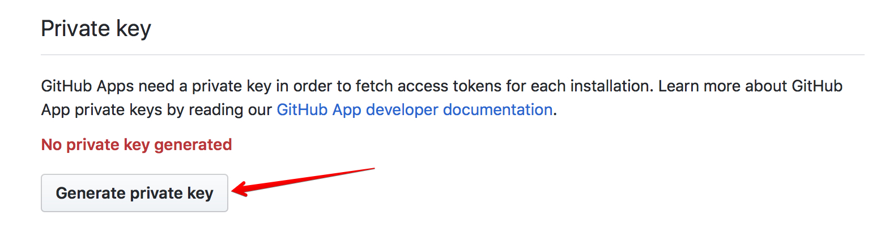
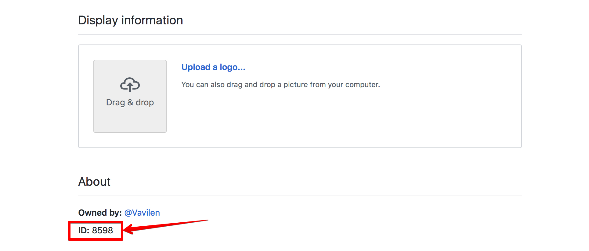
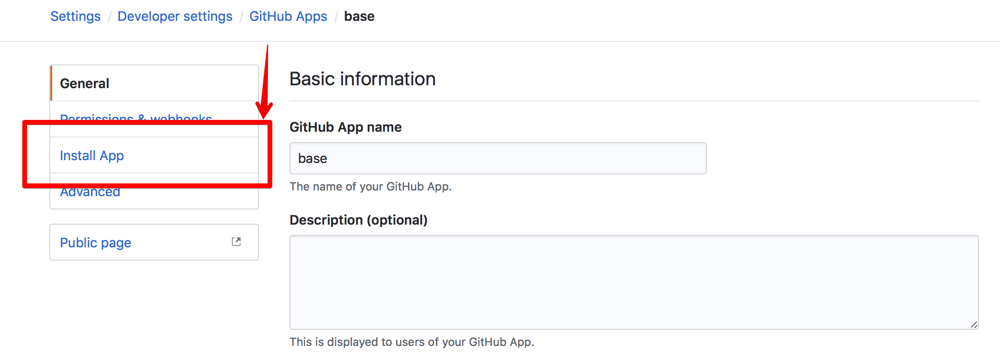

# Utility for fetching closed issues and pull requests

This utility allows you to fetch closed issues and pull requests in some time period.

## Setup

### Prerequisites
* Have go1.8+ installed
* Have `GOPATH` env set

### Install dependencies

```bash
$ go get github.com/bradleyfalzon/ghinstallation
$ go get github.com/google/go-github/github
```

### Create a Github application

Unauthenticated clients are limited to 60 requests per hour,  
while authenticated clients can make up to 5,000 requests per hour.  
The Search API has a custom rate limit.  
Unauthenticated clients are limited to 10 requests per minute,  
while authenticated clients can make up to 30 requests per minute.

To become an authenticated client you need to create a Github application.

Use [this](https://developer.github.com/apps/building-github-apps/creating-a-github-app/) instruction to create a Github application  

#### Get private key
After an app creation, you'll need to generate a private key which will be used as a '-key' param.  
Step 1:  
  
Step 2:  


Now you get your application's `.pem` key. Add a path to a key with the param `-key`

To use utility as an authenticated client the `-integrationID` and `-installationID` params are also required.
#### Get -integrationID param
The `-integrationID` param is located on the app page (https://github.com/settings/apps/{appName})  


#### Get -installationID param
Go to the `Install App` menu option to get the `-installationID` param.  


You can see a value of the param `-installationID` in the address line.  

 
### Run utility
Move to the utility directory
```bash
$ cd services/github-metrics/
```

Build the binary  
Move to the utility directory
```bash
$ go install
```

Now you can run the utility with the params:  
  `-end` end date in format YYYY-MM-DD  
  `-installationID` Github app installationID. 0 by default  
  `-integrationID` Github app integrationID. 0 by default  
  `-key` path to the api key *.pem. empty by default  
  `-org` org name. empty by default  
  `-owner` repo owner. `skycoin` by default (default "skycoin")  
  `-repo` repo name. `skycoin` by default (default "skycoin")  
  `-start` 	start date in format YYYY-MM-DD  

#### There are two usage modes:
 1. Get by `-owner` and `-repo` params
```bash
$ github-metrics -owner skycoin -repo skycoin -start 2018-01-28 -end 2018-01-28 -key /path/to/the/private-key.pem -installationID {installationID}  -integrationID {integrationID} 
```
2. Get by `-org` param
```bash
$ github-metrics -org skycoin -start 2018-01-28 -end 2018-01-28 -key /path/to/the/private-key.pem -installationID {installationID}  -integrationID {integrationID}
```
 