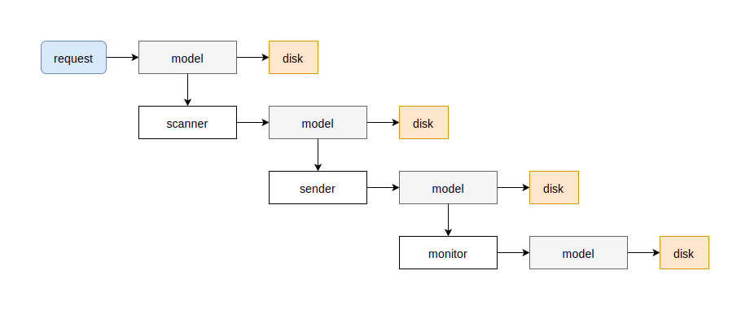
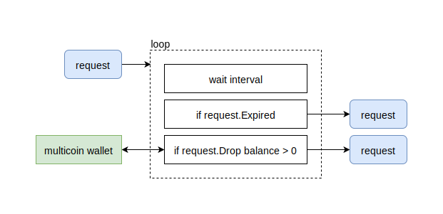
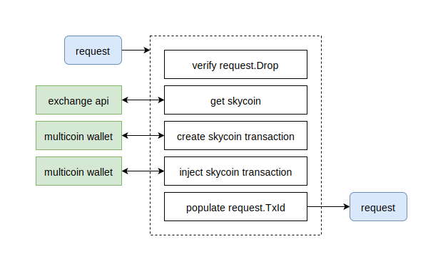

# otc

OTC is a daemon with the sole purpose of exposing an HTTP API that allows users to exchange a variety of currencies (BTC, ETH, etc.) for Skycoin (and others in the future).

# frontend

OTC's frontend is exposed as an HTTP API. 

## /api/bind

This creates a new [request](#request) in the backend and returns JSON output on the frontend. The user can then send their currency to the returned address and the process will begin.

**http request**

```json
{
	"address": "...skycoin address...",
	"drop_currency": "BTC"
}
```

* `address` is the user's skycoin address where skycoin will be delivered
* `drop_currency` determines the type of `drop_address` to generate (what currency the user wants to deposit)

**http response**

```json
{
	"drop_address": "...",
	"drop_currency": "BTC"
}
```

* `drop_address` is the address of type `drop_currency` for the user to send their currency to
* `drop_currency` is the same as sent in the request

## /api/status

This gets the [metadata](#request) of a request and returns it to the user.

**http request**

```
{
	"address": "...skycoin address...",
	"drop_address": "...",
	"drop_currency": "..."
}
```

* `address` is the user's skycoin address where skycoin will be sent
* `drop_address` denotes the address they want the status of
* `drop_currency` denotes the currency of the address they want the status of

**http response**

```
{
	"status": "...",
	"updated_at": 1519131184
}
```

* `status` is one of the following:
	* `waiting_deposit` - skycoin address is bound, no deposit seen yet 
	* `waiting_send` - deposit detected, waiting to send sky to user 
	* `waiting_confirm` - skycoin sent, waiting to confirm transaction 
	* `done` - skycoin transaction confirmed 
	* `expired` - drop expired
* `updated_at` is the unix time (seconds) when the request was last updated

# backend

<p align="center">
	
</p>

**NOTE**

Each component (**scanner**, **sender**, **monitor**) is just a Go package. They aren't separate processes or daemons, *everything is included inside the OTC daemon (single binary)*. The diagrams and information is just to aid in communication and development.

---

A `request` can be created from two sources:

* [frontend](#frontend) http request
* on startup (reading unfinished requests from disk)

Each `request` goes through the following steps:

1. `request.Status = waiting_deposit` - waiting for the user to deposit
	* **scanner** watches `request.Drop` until deposit is detected
2. `request.Status = waiting_send` - waiting for **sender** to send skycoin to `request.Address`
	* **sender** gets skycoin and sends it to `request.Address`
	* **sender** updates `request.TxId` with skycoin transaction ID
3. `request.Status = waiting_confirm` - waiting for **monitor** to confirm skycoin transaction
	* **monitor** watches `request.TxId` until confirmed
4. `request.Status = done` - goroutine exits

The `request` is saved to disk between each transition. So, after step 1, after step 2, after step 3, and after step 4.

At any point, if the `request` has expired, `request.Status` will be set to `expired` and the `request` will be discarded.

### request

```go
type Request struct {
    // Address contains the users Skycoin address.
    Address Address
    // Currency denotes the currency the user wants to exchange. BTC, ETH, etc.
    Currency Currency
    // Drop denotes the address of type Currency for the user to deposit to.
    Drop Drop
    // Metadata contains important data for handling the request.
    Metadata *Metadata
}

type Metadata struct {
    // Status can be:
    //     * "waiting_deposit"
    //     * "waiting_send"
    //     * "waiting_confirm"
    //     * "done"
    //     * "expired"
    Status Status `json:"status"`
    // CreatedAt denotes the unix time when Request was created.
    CreatedAt int64 `json:"created_at"`
    // UpdatedAt denotes the unix time when Request was last updated.
    UpdatedAt int64 `json:"updated_at"`
    // TxId is empty until filled by Sender, then Monitor tracks transaction.
    TxId string `json:"tx_id"`
}
```

## scanner

<p align="center">
	
</p>

The **scanner** continuously checks the balance of `request.Drop` and returns when the balance is greater than zero (user made a deposit), or the request has expired (hours/days with no activity).

### possible errors

* Getting balance of `request.Drop` from multicoin wallet service.

## sender

<p align="center">
	
</p>

The **sender** handles the request once a deposit has been detected. It calculates the equivalent skycoin amount to send based on the current value of `request.Currency`. The **sender** then gets skycoin from an exchange (using exchange api service), or from the OTC wallet. Then, a skycoin transaction is created (using multicoin wallet api) and injected (using multicoin wallet api). The `request.TxId` is filled with the skycoin transaction ID for **monitor** to watch.

### possible errors

* Getting skycoin from exchange api service.
* Creating skycoin transaction from multicoin wallet service.
* Injecting skycoin transaction from multicoin wallet service.

## monitor

<p align="center">
	
</p>

The **monitor** handles the request once skycoin has been sent to the user. It watches `request.TxId` until the skycoin transaction has been confirmed on the network. After a certain number of tries, it will timeout and report the error.

### possible errors

* Getting status of transaction from multicoin wallet service.